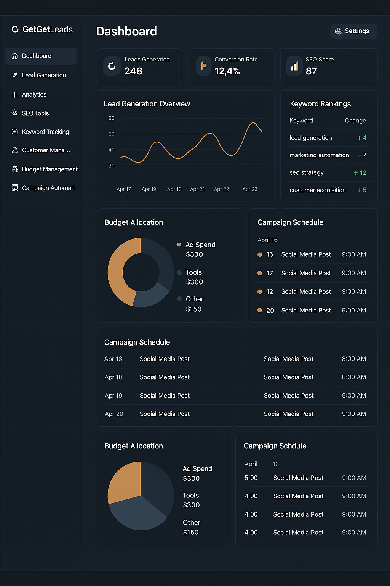

# Data Engineer

---

## 🎓 Education

**Master's in Management Information Systems**

---

## 🧰 Skillset

### 👨‍💻 Programming Languages & Frameworks

Python, Java, JavaScript, C, C#, C++, Scala, R, Shell Scripting, Golang

### ☁️ Cloud Technologies
  
AWS, GCP, Azure, Snowflake, Oracle, Docker, Kubernetes

### 🧪 Big Data & Data Engineering Tools
  
Spark, Kafka, Hadoop, Hive, Airflow, HBase, Nifi, Teradata, Amazon Redshift, MapReduce, Flume, Flink, Informatica, Talend, AWS Glue, S3, Databricks, ADF, Synapse Analytics, Trifacta, JSON, Avro, Parquet, ORC, XML, Protobuf, ELK Stack, PostgreSQL, MongoDB, BigQuery, Elasticsearch, HDFS, Metastore

### 🤖 Machine Learning

TensorFlow, PyTorch, scikit-learn, PySpark, NLTK, LLMs

### ⚙️ DevOps & Monitoring

Jenkins, JIRA, Confluence, Tableau, Power BI, GitHub, Git, RESTful APIs, Splunk, Prometheus, PowerShell, Linux, UI/UX, Bash, Pub/Sub, Jupyter Notebooks, PyCharm

---

## 📂 Projects

### 👥 GhostWriter Teams  
  
An AI-powered collaborative writing assistant that simulates a creative marketing team using local large language models via Ollama and LangChain agents.

**Agents:**
- 🎨 Zara – Creative strategist (hooks, themes, story arcs)  
- ✍️ Max – Content writer (posts, threads, articles)  
- 📊 Mira – Research analyst (insights, trends, timing)  
- 🔍 Eva – Critique expert (feedback, scores, rewrites)  
- 🛡️ Leo – Brand guardian (tone, consistency, alignment)

**Key Features:**
- Full marketing content generation for multiple platforms  
- Editable, exportable calendars with strategic agent feedback  
- Multilingual output and local-first processing (no API keys needed)  
- Interactive UI for selecting agents, downloading kits, and comparing campaigns  
- Export options: PDF, CSV, Markdown  

---

### 🚀 GetGetLeads  
  
An AI-powered marketing platform to streamline lead generation, automate workflows, and manage social media engagement.

**Key Features:**
- 🧲 Lead Generation – Capture and qualify leads effortlessly  
- 📈 Analytics – Visualize what’s working (and what’s not)  
- 🔍 SEO Tools – Boost rankings with smart insights  
- 🏷️ Keyword Tracking – Monitor performance over time  
- 💬 Customer Management – Stay organized and close more deals  
- 💸 Budget Management – Track spend, optimize campaigns  
- 📅 Campaign Automation – Schedule posts and updates like a pro  

---

### ✈️ GetGetPlaces  
  
Your personal AI agent to plan smart, weather-aware, budget-friendly trips — effortlessly.

**Key Features:**
- **Natural Language Understanding** — Just tell it: “Plan a 5-day Miami trip with $1500 for food & beaches”  
- **Dynamic Weather Check** — Real-time forecasts from OpenWeatherMap  
- **Distance & Travel Time Calculation** — Smart routing between attractions  
- **AI-Powered Itinerary** — Personalized daily plans with hotels, restaurants, and must-visit spots  
- **Price Prediction** — ARIMA-based future price forecasts  
- **Intelligent Recommendations** — Machine learning model for tailored suggestions  
- **Database-Ready** — PostgreSQL backend for trips, users, hotels & cars  

**🚀 Example:**  
“Plan a 7-day Orlando & Miami trip with $3000 budget, focus on museums and great food”  
Returns:  
- Day-wise schedules  
- Attractions & restaurant timings  
- Weather-based suggestions  
- Car pick-up & drop-off details  
- Price breakdown  

---

### 🎬 [Movie Recommendation Engine](https://mrs-sg-bfc2e6fa78db.herokuapp.com/)  
  
A system that recommends movies based on selected films.

**Skills:**  
Machine Learning, NLP, Python, Feature Engineering, Recommendation Systems, Data Pre-processing, API Integration, Model Evaluation, Data Visualization

**Tools:**  
Scikit-learn, TensorFlow, NLTK, Pandas, NumPy, TF-IDF, Jupyter Notebooks, PyCharm, Flask, GitHub

---

### 📊 [Data Visualization Projects](https://public.tableau.com/app/profile/santhosh.guntupalli/vizzes)  
A portfolio of data visualizations across academic and professional domains.

**Skills:**  
Data Analysis, Storytelling with Data, Statistical Knowledge, Domain Knowledge

**Tools:**  
Tableau, Matplotlib, Pandas, Python, SQL, NoSQL, Git, GitHub

---

### 📈 [Real-Time Stock Market Analysis](https://github.com/guntupalli09/stock_market-real_time-analysis)  
Live trend analysis for investment decision-making.

**Skills:**  
Data Streaming, Cloud Services, Data Processing, Warehousing, API Integration, Model Evaluation

**Tools:**  
Kafka, AWS EC2, S3, Glue, Athena, Datalog, Crawler, GitHub, Jupyter

---

### 🐍 Snake Game with Python  
  
Created with Tkinter, showcasing GUI and event-handling skills.

---

### 🏓 Pong Game AI – NEAT  
  
Trained an AI to play Pong using NEAT (NeuroEvolution of Augmenting Topologies).

**Approach:**  
AI learns autonomously through reinforcement learning, optimizing its performance to maximize gameplay proficiency.

---

## 📜 Certifications

1. META: Database Structures and Management with MySQL  
2. META: Version Control  
3. META: Advanced MySQL  
4. Prompt Engineering for ChatGPT – Vanderbilt University  
5. IBM: Exploratory Data Analysis for Machine Learning  
6. Machine Learning Specialization – University of Washington  

---

## 💼 Work Experience

### **FedEx Dataworks – Data Engineer II (Remote)**  
*June 2024 – Present*  
- Developed strategic cost calculator using Databricks, ADF, Docker, Kubernetes  
- Built ETL pipelines and managed metadata via Unity Catalog  
- Automated critical cost metrics and presented insights via Power BI  
- Integrated real-time data using Azure Event Hubs  
- Enhanced collaboration across UI/UX, API, and data science teams  
- Supported workflows across Azure and GCP environments  

---

### **Vedhops IT Services – Data Engineer (Remote)**  
*March 2024 – June 2024*  
- Improved computational efficiency in distributed systems  
- Launched 3 cloud-based data solutions using Azure stack  
- Implemented near real-time streaming with low latency  
- Developed automated testing and monitoring frameworks  
- Migrated legacy systems to scalable, cloud-native architectures  
- Leveraged AWS EC2, S3, Lambda for infrastructure provisioning  

---

### **LTI Mindtree – Data Engineer (Hyderabad, India)**  
*September 2019 – August 2022*  
- Designed ETL pipelines with ADF and AWS Glue  
- Optimized analytics on Azure SQL Data Warehouse and Redshift  
- Used Spark, Kafka, SQL/NoSQL for large-scale data ops  
- Created infrastructure as code with Terraform  
- Improved data security and reduced incidents by 25%  

---

