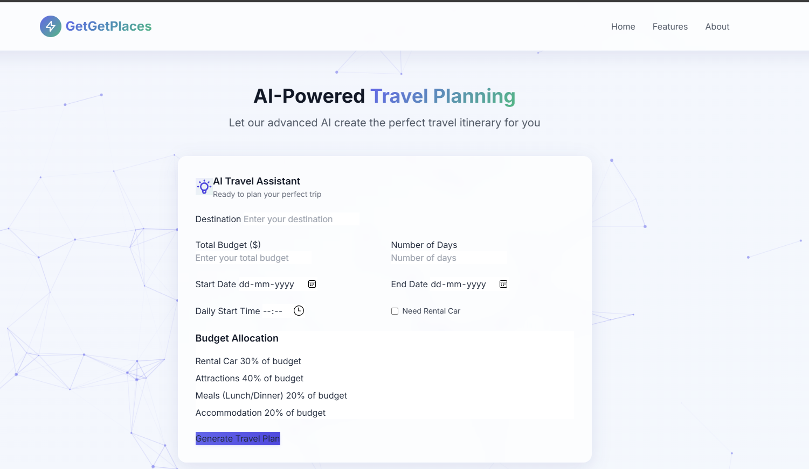
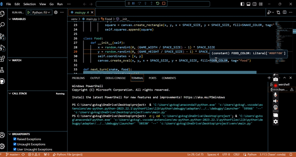
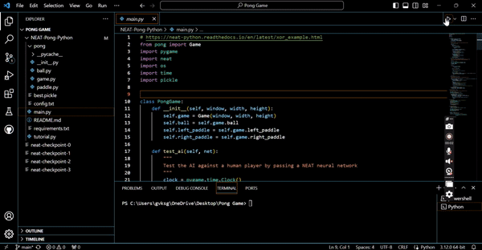

<h1 align="center">🚀 Santhosh Guntupalli</h1>
<h3 align="center">Data Engineer | AI Specialist | Cloud Architect | BI Strategist</h3>

---

## 📌 About Me

I’m a passionate, hands-on engineer with deep expertise across **Data Engineering**, **Machine Learning**, **Cloud Infrastructure**, and **Business Intelligence**. I build reliable, scalable systems that turn data into insights — and AI into action.

---

## 🧠 Technical Skillset

<strong>⚙️ Data Engineering & Cloud</strong>

- Python, Scala, SQL, Shell  
- Spark, Kafka, Airflow, Hadoop  
- Azure, AWS, GCP, Databricks  
- Redshift, Snowflake, BigQuery, Synapse  
- Docker, Kubernetes, Terraform  

<strong>🤖 Machine Learning & MLOps</strong>

- PyTorch, TensorFlow, scikit-learn, PySpark  
- LangChain, HuggingFace, Transformers  
- MLflow, FastAPI, Streamlit, BentoML  
- LLMs, RAG, Recommenders, ARIMA, LSTM  

<strong>📊 Business Intelligence</strong>

- Tableau, Power BI, Superset, Jupyter  
- KPI Dashboards, Forecasting, Real-Time Analytics  

<strong>🗃️ Databases, APIs & Formats</strong>

- PostgreSQL, MongoDB, Oracle, DynamoDB  
- Parquet, Avro, JSON, XML, Protobuf  
- REST, GraphQL, gRPC  

<strong>🧩 DevOps & Engineering Practices</strong>

- GitHub, Jenkins, CI/CD Pipelines  
- Unity Catalog, Data Governance, Agile/Scrum  
- Scalable System Design, Cross-functional Collaboration  

---

## 🚀 Featured Projects

### ⚡ GetGetLeads – AI Marketing Suite  

 
⚡ [GetGetLeads – AI Lead-to-booking & Digital Marketing Agent](https://www.getgetleads.com/login)

<table>
<tr>
<td width="60%">
GetGetLeads is a comprehensive, all-in-one platform designed specifically for small businesses in the salon, med spa, and real estate industries. It combines lead generation, CRM, email automation, social media automation, calendar management, and AI-powered content generation to help small businesses scale efficiently.

**Features:**
- Smart Lead Management
- AI-Powered Email Automation
- Calendar Integration
- Google Calendar two-way sync
- AI Content Generation
- Reviews & Referrals Automation
- Analytics Dashboard
- Niche-Specific Support
- Multi-platform posting and social automation

---
### 👥 GhostWriter Teams  
  
An AI-powered creative content generator with 5 simulated team agents using LangChain & local LLMs.  

**Roles:** Strategist, Writer, Analyst, Critic, Brand Guardian  
**Stack:** Streamlit, LangChain, Ollama, PDF/CSV export

---
### ✈️ GetGetPlaces – AI Travel Planner  
  
Smart travel planner using weather, NLP, and ML to plan custom itineraries.

**Highlights:**  
- ARIMA price forecasting  
- Real-time weather  
- PostgreSQL backend  
- Distance/time optimization

---

### 🎬 [Movie Recommendation Engine](https://mrs-sg-bfc2e6fa78db.herokuapp.com/)  
  
A content-based movie recommender using NLP, TF-IDF & cosine similarity.

**Stack:** Flask, NLTK, Pandas, scikit-learn, Jupyter

---

### 📊 [Tableau Dashboards](https://public.tableau.com/app/profile/santhosh.guntupalli/vizzes)  
Professional dashboards covering healthcare, logistics, and retail.

**Features:**  
Forecasting, KPI, Filters, Drilldowns

---

### 📈 [Real-Time Stock Market Analysis](https://github.com/guntupalli09/stock_market-real_time-analysis)  
Live pipeline for real-time stock trends using AWS & Kafka.

**Stack:** Kafka, AWS Glue, EC2, Athena  
**Output:** Streaming dashboard with trend indicators

---

### 🐍 Snake Game – Python (Tkinter)  
  
A responsive GUI game showing event-driven design and real-time state logic.

---

### 🏓 Pong Game AI – NEAT Algorithm  
  
An AI trained using NEAT to autonomously master Pong via reinforcement learning.

---

## 📜 Certifications

- META: Database Structures & Advanced MySQL  
- META: Version Control  
- Prompt Engineering – Vanderbilt University  
- IBM: Exploratory Data Analysis for Machine Learning  
- Machine Learning Specialization – University of Washington  

---

## 💼 Experience

<strong>🟣 FedEx Dataworks – Data Engineer II</strong> | Remote · 2024–Present

- Databricks cost calculator for C-level KPIs  
- ETL pipelines, Unity Catalog, PySpark automation  
- Azure + GCP integration, Power BI dashboards  

<strong>🟢 Vedhops IT Services – Data Engineer</strong> | Remote · 2024

- Built 3 data platforms using Azure Synapse & ADF  
- Near real-time streaming pipeline with 40% latency reduction  
- Terraform automation + legacy migration to cloud-native  

<strong>🔵 LTI Mindtree – Data Engineer</strong> | India · 2019–2022

- ETL solutions using Glue, ADF, Redshift  
- Data quality, security, IaC via Terraform  
- NoSQL/SQL optimization and event-based ingestions  

---

