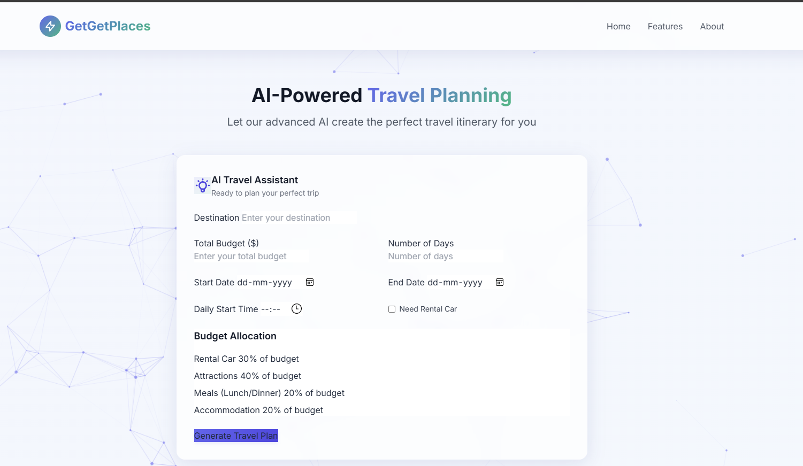

  <a href="index.md">← Back to Home</a>

# 🚀 Featured Projects

Explore some of my most innovative and technical work — covering AI, data pipelines, dashboards, and real-time systems.

---

## 👥 GhostWriter Teams

**Ghostwriter Teams** is your local AI-powered creative department — built to help marketers, creators, and startups brainstorm, write, plan, and critique content like a full-scale agency.

Run locally with open-source models like LLaMA 2 or Mistral (via Ollama), it features five specialized agents working together to produce end-to-end campaign strategies, content calendars, rewrites, and branding insights — all without needing any paid API keys.

---
Ghostwriter Teams simulates a multi-agent marketing team where each AI agent specializes in a unique creative function:

- **Zara** – Creative Strategist  
- **Max** – Content Architect  
- **Mira** – Research Analyst  
- **Eva** – Critic & Challenger  
- **Leo** – Brand Guardian  

You can brainstorm campaign ideas, generate structured content calendars, ask for rewrites, compare campaigns, and export your results — all through an intuitive Streamlit UI.

---

## ✨ Features

- **AI Agents as Roles** (Creative, Writer, Analyst, Critic, Brand Voice)
- **Full Content Calendar Generation** (Markdown tables with copy, dates, platforms)
- **Campaign Brainstorming + Rewrite Assistant**
- **Multilingual Output** (English, French, Hindi, Telugu, Japanese, and more)
- **Local LLM Runtime** with Ollama (LLaMA 2, Mistral, Gemma, etc.)
- **No API Keys Required**
- **Export Campaigns** as PDF, CSV, Markdown
- **Timeline Visualizations** with Altair & Plotly
- **Campaign Comparison & Dashboard View**

---

## 🚀 Example Use Case

> _"I want to launch an AI journaling app for moms. Help me plan 4 weeks of content on Twitter and LinkedIn."_

Ghostwriter responds with:
- A full **platform-specific calendar** of daily posts
- **Emotional hooks** and **CTA optimizations**
- **Eva’s critique** and **rewrite suggestions**
- **Mira’s insights** on trends, audience behavior, and timing
- **Leo’s brand voice check** to ensure tone alignment

Then, you export it all in Markdown, PDF, or CSV

**Tech Stack:** Streamlit · LangChain · Ollama · Local LLMs

---

## ⚡ GetGetLeads – AI Marketing Suite

**GetGetLeads** is a powerful, AI-enhanced marketing automation platform built for modern teams and growth-focused individuals. It helps you generate and manage leads, track marketing performance, automate campaigns, and optimize SEO — all from a clean, intuitive dashboard.

Whether you're a solo founder, marketing team, or agency, GetGetLeads simplifies the complexity of digital marketing with smart tools and automation powered by Supabase and OpenAI.

---

## ⚡ Key Features

- **Lead Generation** – Capture and score leads using AI-driven forms
- **Analytics Dashboard** – Visual insights into traffic, conversion, and ROI
- **SEO + Keyword Tracking** – Monitor rankings and optimize content
- **Budget Management** – Track ad spend, campaign costs, and performance
- **Campaign Automation** – Schedule and automate posts, emails, and outreach
- **Customer CRM** – Manage contacts, notes, and communication history
- **Social Media Automation** - upload social media content post, including tags based on users, interest, and schedule times
---

## 

**Stack:** React · Supabase · Tailwind · OpenAI

---

## ✈️ GetGetPlaces – AI Travel Planner

An intelligent NLP-powered travel planning platform with real-time weather, pricing, and smart routing.

**Stack:** PostgreSQL · ARIMA · OpenWeatherMap · LangChain

**Key Features:**
- Natural language trip planning: “Plan 5-day Miami trip with $1500”
- ARIMA price forecasting (flights, hotels)
- Route optimization + travel time estimates
- Smart daily itineraries with weather forecasts
- PostgreSQL backend for trip data

**Example Use:**
> “Plan a 7-day Orlando trip under $2500 focusing on theme parks and food” → Output: Day-wise schedule, attractions, maps, travel tips

---

## 🎬 [Movie Recommender](https://mrs-sg-bfc2e6fa78db.herokuapp.com/)

An NLP-based content recommender system using TF-IDF and cosine similarity.

**Tech Stack:** Flask · NLTK · Pandas · Scikit-learn · TF-IDF Vectorizer

**Features:**
- Content-based filtering on movie descriptions
- Enter a movie → Get top 5 similar films instantly
- Web app interface with Heroku deployment

**Example Use:**
> Input: “The Matrix” → Output: Sci-fi action recommendations like “Equilibrium”, “Inception”, etc.

---

## 🐍 Snake Game

A classic Snake game made using Python’s Tkinter GUI toolkit.

**Highlights:**
- Real-time movement and key-driven controls
- Score tracking and collision detection
- Minimalistic interface

**Example Use:**
> Launch the app → Arrow keys to control → Eat food to grow → Avoid crashing into walls

---

## 🏓 Pong Game AI – NEAT

Trains an AI to play Pong using the NEAT (NeuroEvolution of Augmenting Topologies) algorithm.

**Tech Stack:** Python · NEAT-Python

**Features:**
- Evolution of neural networks via reinforcement
- AI adapts its paddle response to opponent's movement
- Visualization of evolving agent skill

**Example Use:**
> Launch → Watch AI learn after several generations → Compete against the bot

---

## 📈 Real-Time Stock Dashboard

A real-time pipeline for streaming stock insights and analytics using modern cloud data tools.

**Stack:** AWS EC2 · Glue · Kafka · Athena · S3

**Features:**
- Live data ingestion via Kafka
- Transformation with AWS Glue and Spark
- Query using Athena and visualize in dashboards
- Use case: financial alerting, intraday trend monitoring

**Example Use:**
> Track tickers like AAPL, TSLA → Receive moving averages, trend shifts → Query on demand via Athena

---

  🏠 [Back to Home](index.md) | 📄 [Experience](experience.md) | 📫 [Contact](contact.md)

